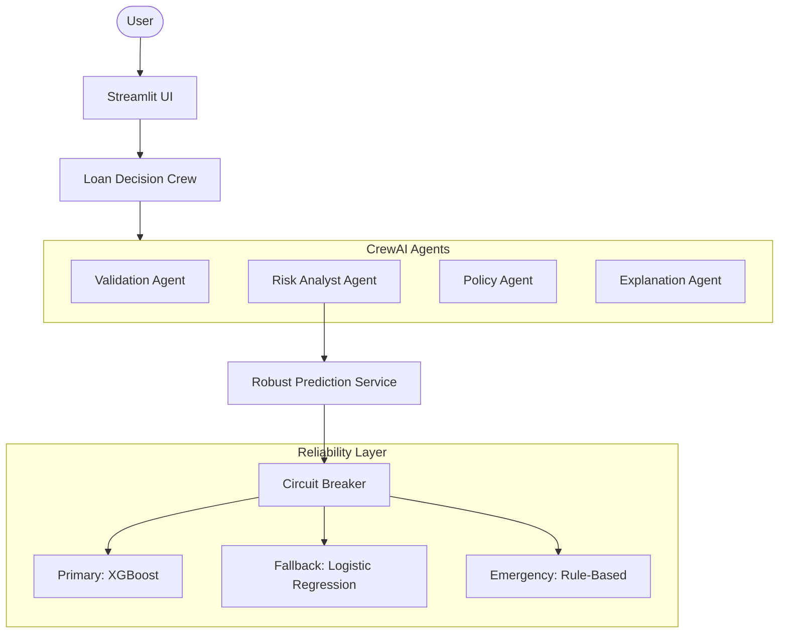

# 🤖 Loan Decision Intelligence System

[](https://loan-default-risk-ml-exfzmyehhzfn9qviwej7bg.streamlit.app/)
[](https://fastapi.tiangolo.com/)
[](https://www.crewai.com/)
[](https://xgboost.readthedocs.io/)

> **Not just predicting loan default, but showing how decisions are made, why they change, and how AI agents collaborate.**

An enterprise-grade Decision Intelligence System that combines predictive machine learning with agent-based reasoning to provide transparent, reliable, and explainable loan risk assessments.

---

## 🚀 Key Features

### 1. 📝 Interactive Loan Evaluation
- **End-to-End Prediction**: Uses a fine-tuned XGBoost model (0.76 AUC) to assess default probability.
- **Agent Orchestration**: 5 specialized CrewAI agents collaborate to validate, analyze, and explain every decision.
- **Multi-Audience Explanations**: Generates tailored narratives for Borrowers, Loan Officers, and Auditors.

### 2. 🎮 Agent Playground
- **Conversation Timeline**: Visualize the step-by-step reasoning of each AI agent.
- **What-If Analysis**: Tweak application parameters (e.g., income, credit score) and see real-time impact on decisions.
- **Agent Battle Mode**: Compare raw ML model predictions against the full agentic decision system.

### 3. 📊 Outcome Dashboard
- **Session Analytics**: Track decision distributions, risk score histograms, and agent influence patterns.
- **Pattern Recognition**: Visualize how the system behaves across multiple evaluations.

### 4. 🛡️ System Health & Reliability
- **Circuit Breaker Pattern**: Protects the system from failing models with automatic failover.
- **Multi-Tier Fallback**: XGBoost → Logistic Regression → Rule-Based emergency system (ensures 99.9% uptime).
- **Health Dashboard**: Real-time monitoring of circuit breaker states and model utilization.

---

## 🧠 Technical Architecture



---

## 🛠️ Tech Stack

- **Machine Learning**: XGBoost, Scikit-Learn, Optuna (HT), SHAP/Permutation Importance.
- **AI Agents**: CrewAI (LangChain based).
- **API**: FastAPI, Pydantic.
- **Frontend**: Streamlit, Plotly.
- **MLOps**: MLflow (Tracking & Registry), Evidently (Drift Detection - planned).
- **Reliability**: Custom Circuit Breaker & Multi-tier Fallback implementation.

---

## 📥 Installation

```bash
# Clone the repository
git clone https://github.com/shlsdhrth16dev/loan-default-risk-ml.git
cd loan-default-risk-ml

# Create and activate virtual environment
python -m venv .venv
source .venv/bin/activate  # On Windows: .venv\Scripts\activate

# Install dependencies
pip install -r requirements.txt
```

---

## 🏃 Usage

### Start Streamlit App
```bash
streamlit run streamlit_app.py
```

### Start FastAPI Server
```bash
uvicorn app:app --reload
```

---

## 🔬 Modeling Details

- **Optimization**: Hyperparameter tuning using Optuna with 5-fold Cross-Validation.
- **Evaluation**: Optimized for F1-score with a custom threshold (0.614) to balance precision and recall.
- **Explainability**: Uses permutation importance to identify key risk drivers (Income, Credit Score, Monthy Debt).

---

## 🤝 Contributing

This is a portfolio project demonstrating production-grade ML engineering. Feedback and suggestions are always welcome via issues or pull requests!

---

## 📄 License

Distributed under the MIT License. See `LICENSE` for more information.

---

**Developed with ❤️ by Sidh**
